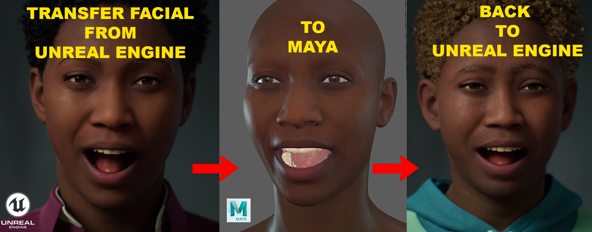
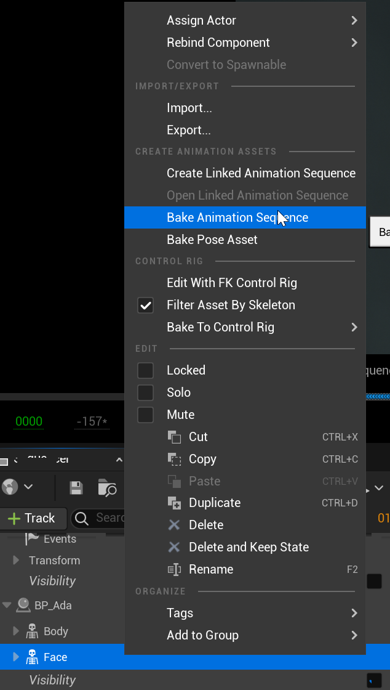
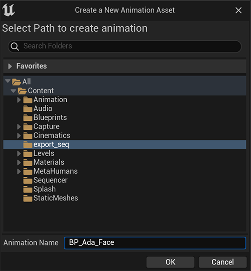
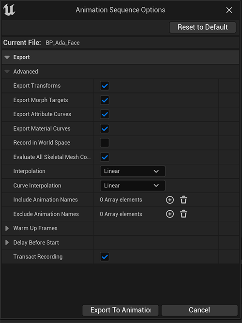
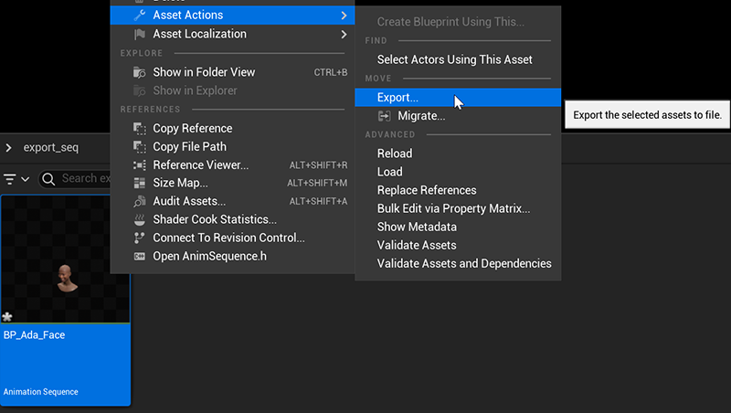
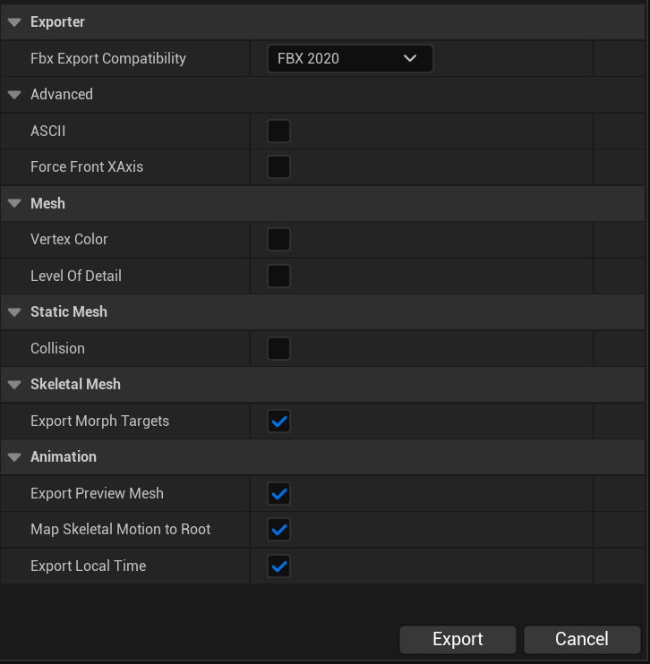
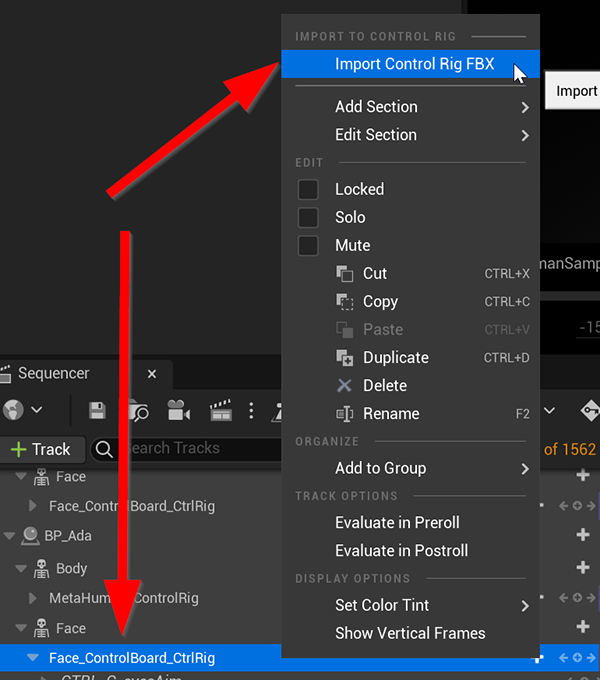
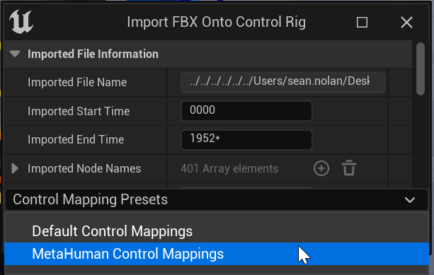

# Metahuman Facial Transfer

Maya Python code that will import previously exported FBX animation from Unreal onto face control animation in Maya.
The code will copy these attribute keys from the imported node over to the Metahuman Face board controls.
The imported data is removed after transfer.
Update animation and export back to Unreal. 

### Newly updated to Support Unreal 4.27-5.2 & Maya 2020-2023

# Tutorial

# Reference links:
* [Exporting a MetaHuman to Maya]( https://dev.epicgames.com/documentation/en-us/metahuman/exporting-metahumans-to-maya)
* [How to Use MetaHuman Animator in Unreal Engine](https://dev.epicgames.com/community/learning/tutorials/eKbY/how-to-use-metahuman-animator-in-unreal-engine)

# Export FBX Data from Unreal
* Export FBX Facial animation out from Unreal Level Sequencer
* Select the "Face" Track

* Bake Animation Sequence
* Save File to a folder

* Animation Sequence export options

* Navigate to new Animation Sequence file and export FBX

* FBX Export options

# Import Control Board FBX Animation from Maya
* Select the 'Face_ControlBoard_CtrlRig track'
* Right-Click and 'Import Control Rig FBX'
* Navigate to FBX to import animation

* Set Control Mapping to 'Metahuman Control Mapping'

* Import

# Install:
* Download Code and open up folder
* Drag and drop install file into viewport to install tool and shelf

# Usage:
* Open/Reference/Import your Metahuman rig into the scene
* Launch Tool
* Select any face control on the control board
* Click 'Set Current Metahuman' button
* Import Animation or Level Sequence Animation FBX file
* Export FBX

Free to use personally or commercially. 
