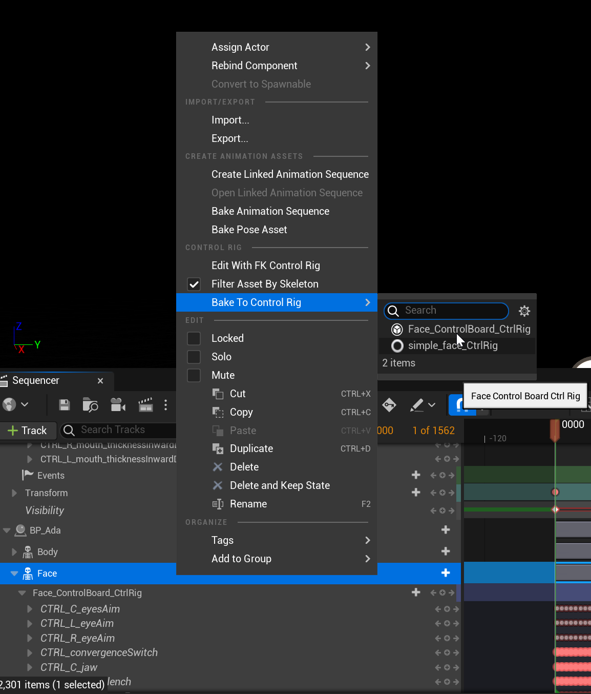
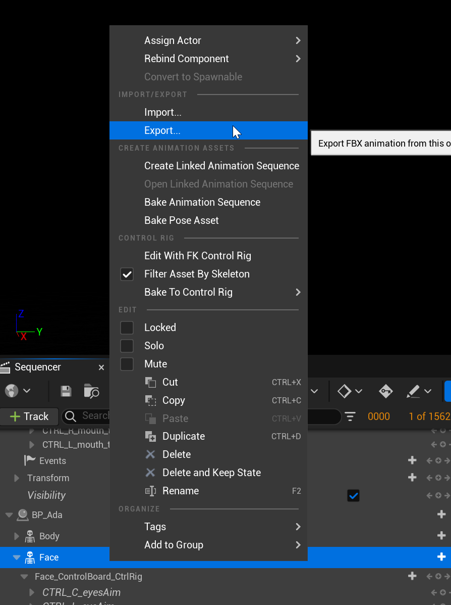

# Metahuman Facial Transfer

# Export FBX Data from Unreal
* Export FBX Facial animation out from Unreal Sequencer
* Select the "Face Track" and not the "Face_ControlBoard_CtrlRig" track

* Bake keys down onto the Control rig
* Select the track and Export FBX


# Install:
* Download script and place somewehere in your MAYA_PYTHON_PATH or maya/<year>/scripts folder

# Usage:
* Open/Reference/Import your Metahuman rig into the scene
* Select a face control on the rig
* Run Code in Maya Python Editor:
```
import metahuman_facial_transfer
metahuman_facial_transfer.import_metahuman_animation()
```
