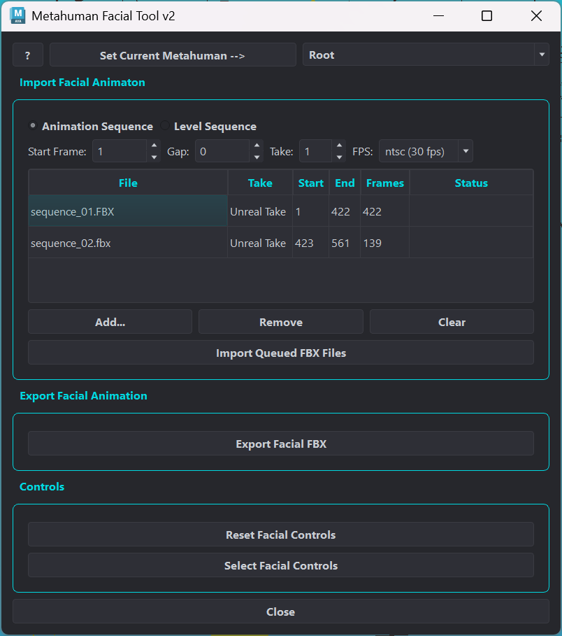
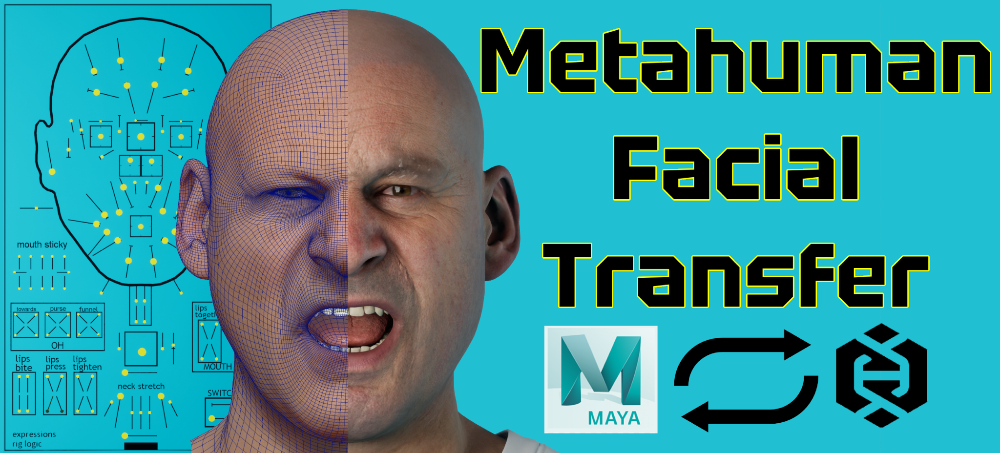
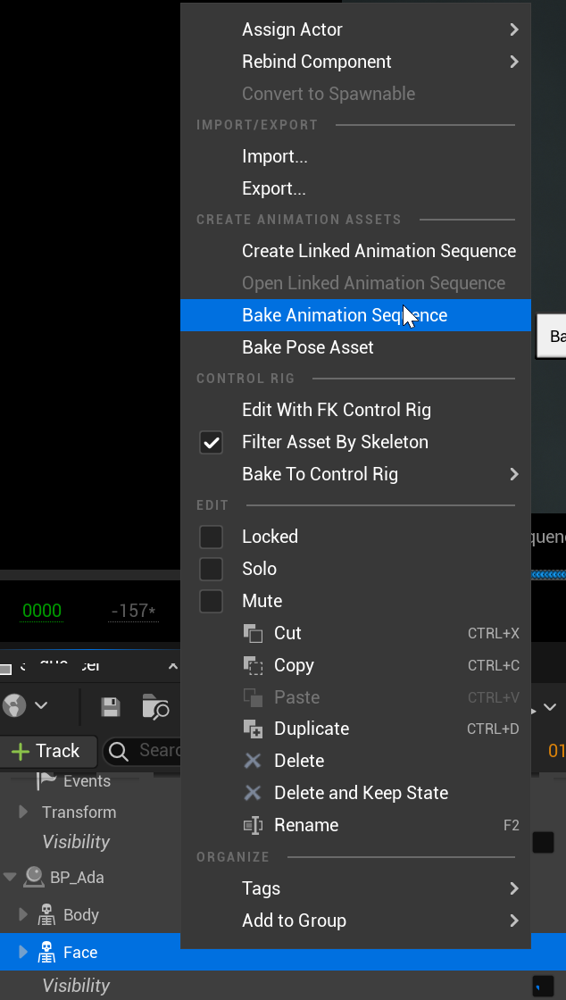
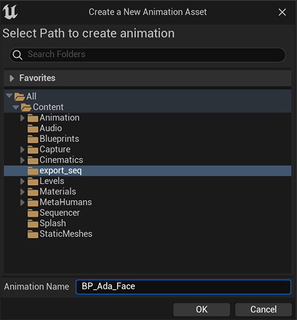
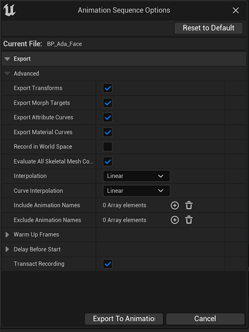
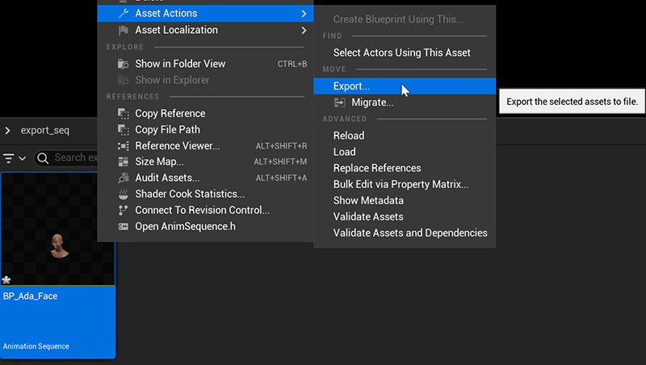
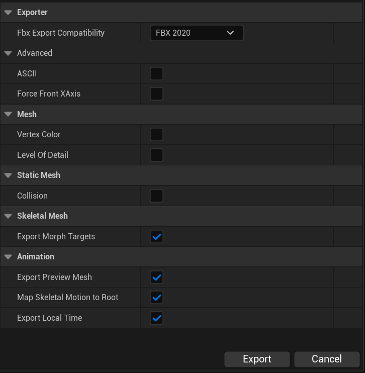
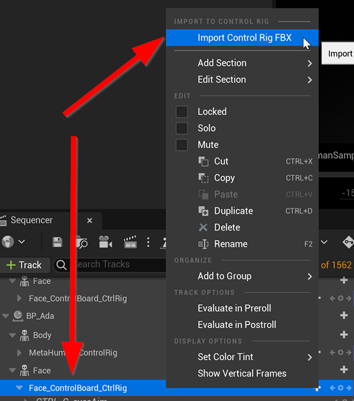
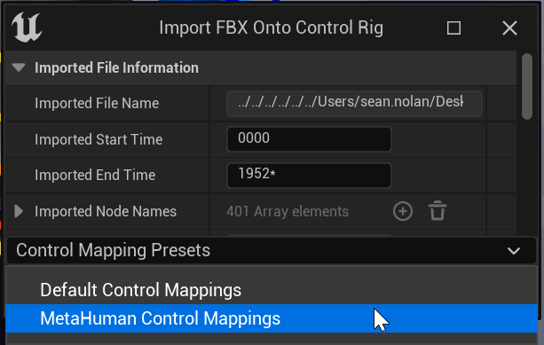

# Metahuman Facial Transfer

Maya Python code that will reference in previously exported FBX animation from Unreal.
The code will copy these attribute keys from the referenced transform node over to the Metahuman Face board controls.
The referenced file is then removed once completed.

## 2.0 — PyMEL removed

Version 2.0 removes the hard PyMEL dependency entirely; the tool now runs on
`maya.cmds`/`maya.mel` only. 

**Supported range:** Maya 2023 through 2027 (Python 3.9-3.13, PySide2/Qt5 on
2023-2024, PySide6/Qt6 on 2025+). (2024 untested — no install was available
during development; expected to work, same PySide2/Qt5 path as 2023.)

**Breaking API change:** functions that used to return PyMEL `PyNode`/`Attribute`
objects now return plain strings (long DAG paths / `node.attr` plug strings):

- `get_face_controls()` → `list[str]`
- `get_root_joint()` → `str | None`
- `export_fbx_animation()` → `list[str]`
- `Controller.control_mapping` → `dict[str, list[[str, float]]]` keyed on plug strings

If you have external scripts calling into `metahuman_api.py` directly (rather
than through the shelf button / UI), update them accordingly.

**Other behavior change:** retargeting a rig where no control has multiple
FBX-driving expressions no longer crashes (a pre-existing crash in the
original PyMEL code, which called `bakeResults([])` unconditionally and threw
`TypeError: Not enough objects for this command` in that case); it now
completes normally with nothing baked onto that control.

**UI Updates:**
The single-file Import buttons are now a queued, multi-FBX table:
- Choose **Animation Sequence** or **Level Sequence** with a radio button instead of two separate buttons
- **Add/Remove/Clear** build a queue of FBX files (the same file can be added more than once to repeat a clip and extend the timeline)
- **Start Frame**, **Gap**, **Take**, and **FPS** controls; Animation Sequence clips are merged and laid end to end starting at Start Frame, while Level Sequence files are each imported independently
- The table previews Take/Start/End/Frames per row before you run anything, and reports per-row status (Merged/Skipped/Imported/error) after
- New UI theme

Still on an older Maya without this fix? The pre-2.0 PyMEL-based version is
preserved at the [`v1.0-pymel`](../../releases/tag/v1.0-pymel) tag.

### Supports Unreal 4.27-5.7+ & Maya 2023-2027

# Tutorial

# Reference links:
* [Exporting a MetaHuman to Maya]( https://dev.epicgames.com/documentation/en-us/metahuman/exporting-metahumans-to-maya)
* [How to Use MetaHuman Animator in Unreal Engine](https://dev.epicgames.com/community/learning/tutorials/eKbY/how-to-use-metahuman-animator-in-unreal-engine)

# Export FBX Data from Unreal
* Export FBX Facial animation out from Unreal Level Sequencer
* Select the "Face" Track
  

* Bake Animation Sequence
* Save File to a folder
  

* Animation Sequence export options
  

* Navigate to new Animation Sequence file and export FBX

* FBX Export options
  

# Import Control Rig FBX Data from Maya
* Right+Click the 'Face_ControlBoard_CtrlRig' track
* Import FBX

# Install:
* Download project
* Drag and Drop install python file into Maya viewport 
* This will install a Shelf and code into maya/scripts folder

# Usage:
* Open/Reference/Import your Metahuman rig into the scene
* Launch Tool 
* Select Face control on Metahuman face rig
* Hit 'Set Current Metahuman'
* Import Animation Sequence Animation FBX from Unreal
* Export Facial FBX back to Unreal

Free to use personally or commercially. 
